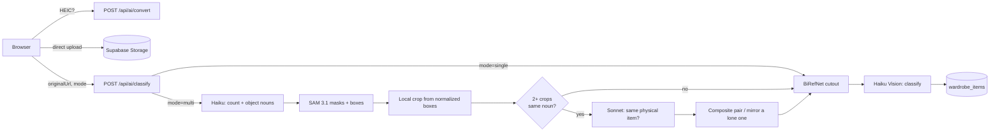
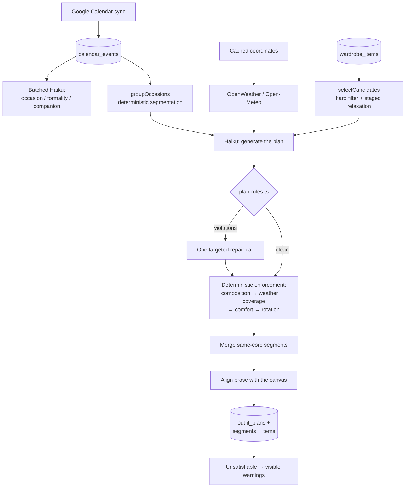

# AI Wardrobe

**Photograph a garment, and the app cuts it out, classifies it, and then plans what you wear — per day, per week, and per trip — against your real calendar, the real forecast, and rules about what can physically be worn together.**

🔗 **Live:** [closet.daidingrdesigns.com](https://closet.daidingrdesigns.com)


[](https://github.com/Daidai1031/ai-wardrobe/actions/workflows/ci.yml)


This is a working product with a custom domain, a paying-service surface (a human stylist console), and a production Supabase database — not a demo. ~24,900 lines of TypeScript across 110 files, 17 pages, 24 route handlers, 20 tables, and 83 unit tests over the parts that decide things deterministically.

---

## Table of contents

- [Screenshots](#screenshots)
- [What it does](#what-it-does)
- [Feature status](#feature-status)
- [Architecture](#architecture)
- [Tech stack](#tech-stack)
- [Project structure](#project-structure)
- [Data model](#data-model)
- [Engineering decisions](#engineering-decisions)
- [Tests & CI](#tests--ci)
- [Getting started](#getting-started)
- [Deployment](#deployment)
- [Cost](#cost)
- [Known gaps](#known-gaps)
- [Roadmap](#roadmap)
- [Documentation map](#documentation-map)
- [License](#license)

---

## Screenshots

> _Add images to `docs/screenshots/` and swap the placeholders below._

| Closet | Daily plan (`/home`) | Week plan (`/plan`) |
|---|---|---|
| _`docs/screenshots/closet.png`_ | _`docs/screenshots/home.png`_ | _`docs/screenshots/plan.png`_ |

| Outfit Canvas | Travel mode (`/travel`) | Stylist console (`/pro`) |
|---|---|---|
| _`docs/screenshots/canvas.png`_ | _`docs/screenshots/travel.png`_ | _`docs/screenshots/pro.png`_ |

---

## What it does

### 1. Digitizing a wardrobe

Upload a photo; the app returns a catalogued garment with a transparent cutout.

- **One item per photo** — background removal (fal.ai BiRefNet v2) → Claude Vision classification (category, subcategory, color, material, season, occasion, style tags) → one row.
- **Several items in one photo** — Claude names the concrete objects it sees, fal.ai SAM 3.1 segments them, and the original pixels are cropped locally from the returned normalized boxes.
- **Pairs are reassembled.** Two crops of the same shoe from different angles are detected by a Claude Sonnet vision pass (it must describe shape, material, hardware and brand before deciding), then composited side-by-side in their real left/right photo order. A lone shoe or earring is mirrored with a literal pixel flip, so the model cannot invent a design that doesn't exist.
- **HEIC** (the iPhone default) is converted client-side before upload.
- **Extra reference angles** — back, side, detail, care label — live in their own table, so outfit rendering structurally cannot mistake them for separate garments.
- **On-demand photo enhancement** — a magic-wand action sends the original plus up to four reference photos to a Seedream edit endpoint under an identity-lock prompt, removes the generated studio background, and fits the piece into a category-specific box on a transparent canvas. Deterministic code, not the model, owns equal visual scale and padding. The result lands in a *candidate* column behind a Before/After confirmation — the original is never overwritten.

### 2. Outfits on a freeform canvas

A collage editor, not a grid: drag to move, corner to resize, bring-to-front on manipulation, clamped to bounds and to a 15–60% width range. Normalized `x/y/width` geometry is persisted, so a look reopens exactly as arranged — and the *same* canvas component is reused by the daily plan, the AI stylist and the human stylist console rather than copied.

### 3. Planning against a real calendar

This is the core of the product, and the part with the most engineering in it.

- **Google Calendar** connects through its own OAuth flow (deliberately separate from Supabase's Google *login*), and events are semantically classified once each — occasion, formality, companion — in a single batched Haiku call.
- **How many outfits a day needs is computed, not asked.** Consecutive occasions are grouped by formality distance; a change of *kind* (transit, athletic, general) always splits a group, because whether you're on a plane or on a court isn't a matter of degree.
- **Weather is per location, per day.** Coordinates are geocoded once and cached on the row, never re-derived per call. A day with a morning meeting at home and an evening event in another city passes *both* cities' conditions to the model.
- **A week is planned in one call**, because the constraints that justify weekly planning — a statement piece not repeating, ≥2 days between wearings of a basic, covering the week's formality range — are things no per-day generation can know.
- **Trips are found on the calendar, not typed in.** Away-ness is decided from coordinates (>120 km from home) or from an explicit destination in the title; away dates merge into runs, bridge gaps, and absorb the flight either side. A change of destination ends a run, so a Hamptons weekend and a London week don't fuse into one 8-day trip planned against the wrong city.
- **Confirming a day is what builds the packing list.** The garment half is *derived* from the confirmed outfits — it structurally cannot disagree with them. The non-garment half is a fixed template plus the user's own additions, never generated, because a model forgets the phone charger and invents an adaptor you don't own.
- Two ways out of the app: a print/PDF route in its own layout-free route group, and a revocable public share link backed by a 128-bit CSPRNG token.

### 4. The model proposes; TypeScript disposes

Every generated plan passes through deterministic rules in `src/lib/planning/plan-rules.ts` before it can be persisted. All of them were first stated in the prompt, and all of them were broken anyway:

| Rule | What it guarantees |
|---|---|
| **Composition** | One bottom, one dress, one pair of shoes, one bag; two tops and two layers. The generator once produced a segment wearing two pairs of trousers. |
| **Incompatibility** | A dress is never combined with a top or trousers — per-category caps alone allowed it, since each piece was under its own limit. |
| **Coverage** | A segment must cover torso, legs and feet. The generator once produced a day whose entire outfit was one pair of sandals, because until then the rules only said what was *too many*. |
| **Weather** | Above 30 °C: no outerwear, no long sleeves. Season tags don't catch this — items are routinely tagged both spring and summer. |
| **Rotation** | How many days out of any rolling seven an item may appear on, per category — and **the limits are the user's**, stored per profile and merged over the defaults. The window doesn't restart with the request: history from the surrounding days is loaded, so redoing one day can't quietly break the week it belongs to. |
| **Comfort** | No heels on a flight; no gym kit at a board meeting; nothing worn during sport is reused later that day; and a sport segment must actually be sport — golf kept arriving in a midi dress and white pumps. |

A violation triggers **one** targeted repair call naming the specific item and date — then every rule is enforced deterministically anyway, in an order chosen because removing something opens a hole, filling a hole can put heels back on a flight, and any swap can create a repeat. Whatever remains unsatisfiable on a genuinely small wardrobe comes back as a visible warning rather than being swallowed: a repeat the user can see explained reads as a closet limitation; an unexplained one reads as carelessness.

Two passes then reconcile the output with reality: adjacent segments wearing the same *core* pieces are merged (swapping the shoes is not a change of outfit), and the model's prose is scrubbed of sentences naming pieces the rules removed underneath it.

### 5. A human stylist console

A staff-only role gets a different app. `/pro` lists clients with an open access window; the workspace reviews their closet, saved looks and planned days, and everything the stylist saves is a **proposal** — it does not touch the client's rows until the client accepts. Accepting snapshots what it replaced, so undo restores the exact prior version.

Access is a role plus a time-boxed window, and the rule exists in two places on purpose: a `security definer` Postgres function that actually protects the data, and a TypeScript mirror used only for routing and copy. **RLS is a whitelist** — exactly five tables carry the extra stylist-visibility policy; the calendar, OAuth tokens, journal and plan tables have none, and neither will anything added later. Forgetting to add one is safe; adding one by reflex is not.

Calendar sharing is three levels: off by default; generalized wording assembled from two closed enums (so it *structurally* cannot leak a name, unlike asking a model to redact); and per-event opt-in for the raw title. Model-authored segment labels are never projected.

---

## Feature status

Honest labels. **Live** means exercised end-to-end against a real account and the production database; **Built** means it type-checks, lints, builds and has its schema applied, but the browser path hasn't been walked yet.

### Wardrobe

| Feature | Status | Notes |
|---|---|---|
| Email auth, protected routes | ✅ Live | Session refresh + route protection in `src/proxy.ts` |
| Google OAuth sign-in | 🟢 Built | Needs the Supabase provider configured |
| Single-item upload pipeline | ✅ Live | BiRefNet cutout → Haiku Vision classification |
| Multi-item segmentation (SAM 3.1) | ✅ Live | Verified on a 4-purse photo returning 4 masks/boxes |
| Shoe pairing + lone-item mirroring | ✅ Live | Verified on 3-real-pairs and 6-unrelated-singles photos |
| Earring / bracelet generalization | 🟡 Built | Same code path; not yet run against a real photo |
| Single/multi toggle (skips a vision call) | ✅ Live | The common case no longer pays for detection |
| HEIC → JPEG conversion | ✅ Live | |
| Closet browse, filter, favorite, delete | ✅ Live | |
| Item detail edit + user-authored name/notes | 🟢 Built | Treated as authoritative context by every AI prompt |
| Extra reference angles | 🟡 Built | Requires schema §17 |
| Magic-wand photo enhancement | 🟡 Built | Requires the photo-enhancement schema block |
| Recommended looks on an item | 🟡 Built | Page load never calls AI; generation is an explicit click |

### Outfits & stylist

| Feature | Status | Notes |
|---|---|---|
| Freeform Canvas builder, persisted geometry | ✅ Live | Shared component across `/outfits`, `/home`, `/plan`, `/stylist`, `/pro` |
| Save / edit / delete saved looks | ✅ Live | |
| AI Stylist — discovery questions → validated look | 🟡 Built | Forced Anthropic tool choice + plain-text fallback |
| Human stylist booking (slot picker) | 🟡 Built | Requires §16. Postgres exclusion constraint is the final race guard |
| `/pro` review console + proposals + undo | 🟡 Built | Requires §18, a role flip, and an open window on a test client |

### Planning

| Feature | Status | Notes |
|---|---|---|
| Google Calendar OAuth + token refresh | ✅ Live | Failed refresh marks the connection invalid instead of 500-ing |
| Event sync + batched semantic classification | ✅ Live | Verified against 8 real events; each event classified exactly once |
| Local-day bucketing across timezones | ✅ Live | Verified across a UTC-date boundary and under a second timezone |
| Daily multi-segment plan (`/home`) | ✅ Live | DB is the only cache; per-segment redo; atomic "worn" journal write |
| Weekly 7-day plan (`/plan`) | 🟢 Built | One plan per date regardless of source |
| Deterministic plan rules | 🟢 Built | Covered by a synthetic harness reproducing the reported failures |
| User-configurable repeat rules | 🟡 Built | Requires §19; degrades to defaults rather than failing |
| Weather: current + forecast, multi-city | ✅ Live | OpenWeather for today, Open-Meteo for future dates |
| Per-event location override | 🟢 Built | Kept separate from Google's raw location, which sync must not erase |

### Travel

| Feature | Status | Notes |
|---|---|---|
| Trip detection from the calendar | ✅ Live | Verified against real calendar rows in production |
| User overrides of detection (split/merge) | 🟢 Built | §22 applied; decisions expire when the calendar reshapes the trip |
| Business / leisure classification | 🟢 Built | Title-first, then event formality; the reason is shown in the tooltip |
| Per-trip planning through the weekly route | 🟡 Built | §21/§21b applied and verified from both sides |
| Confirm & pack, derived packing list | 🟡 Built | |
| Print / PDF cards | 🟡 Built | `@media print`, not a headless browser |
| Public share link | 🟡 Built | 128-bit token, revocable, `noindex` |

### Operations

| Feature | Status | Notes |
|---|---|---|
| Vercel deployment + custom domain | ✅ Live | |
| Supabase keep-alive cron + failure webhook | ✅ Live | Alert delivery tested against a real Discord webhook |
| Consultation webhook (opens the stylist window) | 🟢 Built | Provider-agnostic; the automation tool never sees the service key |

---

## Architecture

Next.js 16 App Router — Server Components for data loading, Route Handlers for everything that touches a paid API or the service role, Client Components only where there's a real interaction to own.

### Upload pipeline



### Planning pipeline



### Auth & data boundary

Three Supabase client factories exist and are **not** interchangeable — browser, server-cookie-bound, and service-role. The service role is confined to exactly the cases that cannot work under a session: OAuth tokens (RLS enabled, no policy — the client is denied entirely), global booking availability, the stylist's writes, and the public share page.

---

## Tech stack

| Layer | Choice | Why |
|---|---|---|
| Framework | Next.js 16 (App Router), React 19 | Server Components for loading, Route Handlers for secrets and paid calls |
| Language | TypeScript 5.7, strict | The DB types are hand-maintained mirrors of `schema.sql` |
| Styling | Tailwind CSS 3, `lucide-react`, `sonner` | |
| Auth / DB / Storage | Supabase (Postgres + RLS + Storage) | One service; RLS is the actual access boundary, not app-layer checks |
| Vision & language | Claude Haiku 4.5 (classification, planning, stylist); Claude Sonnet 5 (duplicate-pair reasoning) | Haiku is ~3× cheaper and the calls are per-item; Sonnet is reserved for the one call that failed at Haiku's level and fires rarely |
| Image ML | fal.ai — BiRefNet v2 (cutout), SAM 3.1 (segmentation), Seedream v5 lite edit (enhancement) | |
| Image processing | Sharp | Downscaling for Claude's 10 MB limit, alpha trimming, compositing, mirroring |
| Weather | OpenWeatherMap (current), Open-Meteo (forecast) | Behind a provider interface that only ever deals in coordinates |
| Integrations | Google Calendar API (own OAuth flow) | |
| Hosting | Vercel + Vercel Cron | |

---

## Project structure

```
src/
├── app/
│   ├── (auth)/                     login, signup — unauthenticated
│   ├── (dashboard)/                the app, behind the sidebar + proxy.ts
│   │   ├── home/                   today's multi-segment plan
│   │   ├── plan/                   7-day planning, repeat-rule settings
│   │   ├── closet/, closet/[id]/   browse, upload, item detail, extra angles
│   │   ├── outfits/                saved looks + freeform Canvas builder
│   │   ├── stylist/                AI stylist + human-stylist booking
│   │   ├── travel/, travel/[id]/   detected trips, plan, confirm, pack
│   │   ├── analytics/              closet health, style DNA, declutter
│   │   ├── profile/                profile, connected accounts, sharing
│   │   └── pro/, pro/[clientId]/   staff-only stylist console
│   ├── (print)/travel/[id]/print/  chrome-free print/PDF layout
│   ├── trip/[token]/               public read-only shared trip (no session)
│   └── api/
│       ├── ai/                     classify, convert, daily, weekly, stylist,
│       │                           item-outfits, items/[id]/enhance, references
│       ├── google/                 auth, callback, disconnect, calendar/sync
│       ├── travel/trips/           resolve, decisions, rename/share
│       ├── stylist/                bookings, reviews, reviews/[id]/respond
│       ├── weather/, geocode/      provider + geocoding endpoints
│       ├── calendar/events/[id]/   user location override
│       ├── webhooks/               consult-ended (opens the access window)
│       └── keep-alive/             Vercel Cron target
├── components/
│   ├── closet/                     upload zone, item card, enhancer
│   ├── outfit/                     shared Canvas, segment editor, save button
│   ├── stylist/                    client-side suggestion inbox
│   ├── travel/                     trip printout (print + share share one layout)
│   └── layout/, ui/                sidebar, primitives
├── lib/
│   ├── ai/                         classify, remove-bg, segment, enhance, references
│   ├── calendar/                   event classification, local-day bucketing
│   ├── planning/                   candidates, plan-rules, occasion-groups,
│   │                               merge-segments, segment-text, plans
│   ├── travel/                     detect-trips, trips, packing, trip-render
│   ├── weather/                    types, openweather, open-meteo, geocode,
│   │                               calendar-location
│   ├── stylist/                    access gate, overview, occasion projection
│   ├── google/                     OAuth client, Calendar API wrapper
│   ├── supabase/                   browser / server / service-role factories
│   ├── wardrobe/                   shared image + label resolution
│   └── images/                     HEIC conversion
├── types/                          hand-maintained DB + API contract mirrors
└── proxy.ts                        Next 16's middleware equivalent
tests/                              unit tests for the deterministic core
├── planning/                       plan rules, occasion segmentation
├── travel/                         trip detection
└── calendar/                       local-day bucketing
supabase/schema.sql                 source of truth for the database
.github/workflows/ci.yml            lint → typecheck → test → build
```

---

## Data model

20 tables in Postgres, most with RLS keyed on `auth.uid() = user_id` (or an ownership join for child rows). Highlights:

- **`wardrobe_items`** + `wardrobe_item_photos` — the closet and its extra reference angles, kept in separate tables so outfit code cannot read an angle as a garment.
- **`outfits` / `outfit_items`** — saved looks, with normalized canvas geometry on the junction.
- **`outfit_plans` / `outfit_plan_segments` / `outfit_plan_segment_items`** — a date's plan, its ordered segments, and each segment's ordered items. **A date has exactly one plan**; `source` records how it was produced but is not part of its identity, because keying on it let one Thursday carry two independent generations that showed different outfits on different pages.
- **`calendar_events`** — synced events plus the derived semantic fields and cached weather coordinates, with the user's overrides kept in separate columns so a read-only sync can never erase a correction.
- **`travel_plans` / `travel_trip_decisions`** — only what detection can't derive: a trip's signature, confirmations, packing list, share token, and the user's corrections to detection.
- **`stylist_reviews` / `stylist_review_items`** — proposals, readable by both parties and writable by neither; all writes go through validated routes and RPCs.
- **`google_connections`** — **RLS enabled with no policy at all.** Deliberate: the browser is denied entirely and only the service role ever touches OAuth tokens.
- **`wardrobe_access_log`** — every server-side stylist read. Client-readable, stylist-invisible. Built up front, because a log added later has no history.

Atomicity that matters is in the database, not in the route: `apply_plan_segment_items()`, `save_outfit_plan_segment()`, `replace_weekly_plans()`, `accept_stylist_review()` / `revert_stylist_review()`. A partial week doesn't satisfy the cross-day constraints that were the point of planning a week.

---

## Engineering decisions

The reasoning is in `CLAUDE.md` and `Roadmap.md`; these are the ones that shaped the codebase.

| Decision | Why |
|---|---|
| **Anything exactly decidable lives in TypeScript, not in the prompt** | Segment count, trip boundaries, outfit composition and rotation were all specified in prose first, and the model broke each of them. A model asked the same question twice also answers differently, which would re-key stored rows. |
| **The model's output is repaired once, then enforced deterministically** | A code-chosen substitute styles worse than the model would. It still beats shipping a look that can't be worn. |
| **A date has exactly one plan** | Keying a plan on its `source` gave the same Thursday two rows, and the user saw different outfits on `/home` and `/plan` with nothing syncing them. |
| **Coordinates are geocoded once and cached on the row** | Geocoding per weather call is a wasted external request per generation for a city that never moves. |
| **Calendar and Gmail are two independent OAuth grants** | `gmail.readonly` is a restricted scope needing a paid review; bundling them would mean declining Gmail also loses Calendar. |
| **Print via `@media print`, not headless Chrome** | Serverless would need a bundled Chromium; the cold start and bundle size cost more than the feature. |
| **The packing list's garment half is derived, never edited** | The only honest way to change what you're packing is to change an outfit. Its non-garment half is a fixed template, because a model forgets the charger and invents an adaptor you don't own. |
| **Stylist RLS is a whitelist of five tables** | Forgetting to add a table is safe; adding one by reflex is not. |
| **Generalized occasion wording is assembled from closed enums** | It structurally cannot leak a name — unlike asking a model to redact, which works until it doesn't. |
| **Haiku by default; Sonnet only where Haiku demonstrably failed** | Classification is per-item and constant; duplicate-pair reasoning fires rarely and was unstable at Haiku's level. |
| **No per-stylist grants table until a second stylist exists** | With one stylist, every row's `stylist_id` is the same value. A role plus a time-boxed window is the same guarantee with none of the schema. |

---

## Tests & CI

```bash
npm test           # 83 tests, ~0.5s
npm run test:watch
```

Vitest, no test runner config beyond a path alias — `vitest.config.mts` is 30 lines and pulls in no plugin.

**The suite covers the deterministic core, and deliberately nothing else.** Those are the modules that decide things in TypeScript rather than by asking a model, so they are the ones where a regression is both possible and silent:

| Suite | What it locks in |
|---|---|
| `tests/planning/plan-rules.test.ts` | Composition, coverage, weather, comfort and rotation — every case is a failure that actually shipped: two pairs of trousers in one segment, a day whose whole outfit was one pair of sandals, heels on an overnight flight, golf in a midi dress and pumps, the same blazer three days running under a one-day-a-week limit. Plus the full enforcement pipeline in the order the routes run it. |
| `tests/planning/occasion-groups.test.ts` | That a day's segment count is stable, that a change of *kind* splits a group regardless of formality, and that "Travel budget review" is a meeting while "Depart for JFK" is a flight. |
| `tests/travel/detect-trips.test.ts` | Trip boundaries, including both adjacency bugs: a Hamptons weekend and a London week must not fuse, and one word geocoded to two different places must not split. Plus signature stability, the no-date-in-two-trips rule, and the user's split/merge overrides. |
| `tests/calendar/day-bucket.test.ts` | The two timezone traps — a timed event crossing the UTC date boundary must land on the local day it happens on, and an all-day event must *not* be converted at all. |

Every test is a pure function call. Nothing here reaches the network, Supabase, or an API key, and nothing renders a component — so the suite is not a substitute for the live verification the status tables track, and it isn't meant to be. It exists so that the rules which took three rounds of "the prompt says so and it did it anyway" to get right cannot quietly regress.

`.github/workflows/ci.yml` runs **lint → typecheck → test → build** on every push to `main` and every PR. The build step supplies placeholder credentials, because several modules construct their SDK client at module scope and the Anthropic SDK throws on an empty key — nothing in CI issues a request.

---

## Getting started

### Prerequisites

Node 20+, a Supabase project, and API keys for Anthropic and fal.ai. OpenWeather and Google Cloud are optional but unlock planning and calendar features.

```bash
git clone https://github.com/Daidai1031/ai-wardrobe.git
cd ai-wardrobe
npm install
# create .env.local with the variables in the table below
npm run dev                        # http://localhost:3000
```

```bash
npm run dev        # dev server
npm run build      # production build
npm run start      # serve the production build
npm run lint       # ESLint (Next 16 removed `next lint`)
npm run typecheck  # tsc --noEmit, over src/ and tests/
npm test           # vitest run
npm run test:watch # vitest, in watch mode
```

### 1. Supabase

1. [supabase.com](https://supabase.com) → **New Project**.
2. **SQL Editor** → paste `supabase/schema.sql` → Run. This also creates the `wardrobe` storage bucket and its policies; if it doesn't, create a bucket named `wardrobe` with public read.
3. **Settings → API** → copy `Project URL`, the `anon public` key, and the `service_role` key.

**For an existing database, don't re-run the whole file.** There is no migration tooling here — a schema change only reaches the database when someone applies it. Run the re-runnable blocks you're missing:

| Block | Contents |
|---|---|
| §15 | Planning tables + atomic RPCs |
| §16 | Human stylist bookings |
| §17 | `wardrobe_item_photos` (extra item angles) |
| §18 | Stylist reviews — **re-run if applied before 2026-08-13** (item reviews and stylist-built looks widened two check constraints, which `create table if not exists` alone does not do) |
| §19 | `profiles.rotation_limits` |
| §20 | Saved-look reuse inside plans |
| §21 + §21b | Travel columns, and the two-argument `replace_weekly_plans` — **§21b drops the one-argument version first**; leaving both makes every call ambiguous between overloads, which PostgREST reports as an illegible 300 |
| §22 | `travel_trip_decisions` |
| Photo enhancement | `wardrobe_items` optimized/candidate columns + photo analysis cache |

Two things learned the hard way:

- **Run each block as its own submission.** The editor wraps a submission in one transaction, so a later failure silently rolls back statements that already succeeded — which is how a section can report "constraint already exists" and then be entirely absent a minute later. Confirm what landed with a query against `information_schema` / `pg_constraint` / `pg_proc` rather than trusting the success message.
- **Copy from `supabase/schema.sql` itself**, not from anywhere the text has been re-rendered. A paste with characters silently dropped produced `alter table public.t exists trip_typetext` from a correct one-line statement, and the syntax error points at text that reads fine wherever you copied it from.

**Symptom of a skipped block:** the feature fails at runtime with PostgREST `PGRST205` — `Could not find the table 'public.<name>' in the schema cache` — while `npm run build` still passes, because the TS types are hand-written mirrors and type-check fine against a table that doesn't exist. If the table *is* there and you still get `PGRST205`, the cache is stale: run `notify pgrst, 'reload schema';`. §19 is the deliberate exception — `rotation_limits` is read by its own small query, so a missing column falls back to the built-in defaults instead of taking `/home` and `/plan` down; the only visible symptom is that the "Repeat rules" panel won't save.

### 2. Auth

Supabase → **Authentication → Providers**. Email is on by default (turn off "Confirm email" for local dev). Google sign-in is optional and separate from the Calendar integration below.

### 3. Environment variables

| Variable | Required | Purpose |
|---|:--:|---|
| `NEXT_PUBLIC_SUPABASE_URL` | ✅ | Project URL |
| `NEXT_PUBLIC_SUPABASE_ANON_KEY` | ✅ | Browser client |
| `SUPABASE_SERVICE_ROLE_KEY` | ✅ | **Server-only, never `NEXT_PUBLIC_`.** OAuth tokens, global booking availability, stylist writes, public share page |
| `ANTHROPIC_API_KEY` | ✅ | Classification, planning, stylist |
| `FAL_KEY` | ✅ | Background removal, segmentation, enhancement |
| `GOOGLE_CLIENT_ID` / `GOOGLE_CLIENT_SECRET` | ✅ | Calendar OAuth (see below) |
| `OPENWEATHER_API_KEY` | — | Current conditions; weather features degrade gracefully without it |
| `STYLIST_TIME_ZONE` | — | The human stylist's working calendar, IANA, default `America/New_York`. Slots are generated here and displayed in each client's own timezone |
| `CONSULT_WEBHOOK_SECRET` | — | Shared secret for the consultation webhook. Unset means no stylist access window can ever open |
| `KEEP_ALIVE_ALERT_WEBHOOK` | — | Slack/Discord webhook the keep-alive cron pings on failure; unset means log-only |

### 4. Google Calendar OAuth

Separate from Supabase's Google *login* provider: that one is sign-in only, and Supabase hands back `provider_refresh_token` once and doesn't persist it — unworkable for a long-lived Calendar connection. This flow is `/api/google/auth` → `/api/google/callback`, with its own token storage.

1. [Google Cloud Console](https://console.cloud.google.com) → **APIs & Services → Library** → enable **Google Calendar API**.
2. **OAuth consent screen** → User type **External**, publishing status **Testing** (Production would require a paid CASA review for the `gmail.readonly` scope planned later; Testing caps you at 100 test users, which is fine pre-launch).
3. Add your development Google accounts under **Test users** — Testing-mode apps reject any account not listed.
4. **Credentials → Create Credentials → OAuth client ID → Web application.** Authorized redirect URIs: `http://localhost:3000/api/google/callback` and `https://<your-domain>/api/google/callback`. The redirect URI is derived from the request origin at runtime, so there's no separate env var — it just has to be registered.
5. Under **Scopes**, add `.../auth/calendar.readonly`.

Testing-mode refresh tokens expire after ~7 days. `getAccessToken()` handles a failed refresh by marking the connection invalid and returning `null`, so the app degrades to "please reconnect Calendar" rather than a 500. Re-running the auth flow re-authorizes and clears the flag.

### 5. Opening a stylist's access window

`POST /api/webhooks/consult-ended` is the one automation hook in the product: it takes `{"client_email": "..."}` plus an `x-webhook-secret` header, and sets that client's `access_expires_at` 14 days out — which is what makes them appear in the stylist's console.

It's deliberately provider-agnostic (Zapier, n8n and curl all work), it never sits on a user-facing critical path, and the automation tool **never** receives the service role key. Two things to know: it is not idempotent — re-triggering silently re-extends the window — and a client can end their window early from `/profile` regardless of what the automation set.

The stylist's own account is set up by hand, once, and there is no self-service path:

```sql
update public.profiles set roles = '{client,stylist}' where email = '<stylist email>';
```

---

## Deployment

```bash
npm install -g vercel
vercel
```

Add the same environment variables in **Vercel → Project → Settings → Environment Variables**. For a custom domain, add it under **Domains** and point a CNAME at `cname.vercel-dns.com`.

**Keeping Supabase awake.** The free tier pauses a project after ~7 days of inactivity. `vercel.json` registers a cron (`0 0 */3 * *`) hitting `GET /api/keep-alive`, which runs a trivial `select id from profiles limit 1` and returns an empty `200`. No auth cookie is present on a cron request, so the query runs as anon and returns zero rows under RLS — that still counts as activity. If the check itself fails, the route best-effort POSTs to `KEEP_ALIVE_ALERT_WEBHOOK` before returning `500`.

**Known limitation:** this catches a *failed* run, not the cron *not firing at all* — a route that never runs can't alert on itself. A true dead-man's-switch needs an external monitor (e.g. a healthchecks.io "expected every N days" check) on the same endpoint.

---

## Cost

Roughly **$1.20/month** for 3 users at ~50 items each — down from ~$4.50 on Sonnet, after moving classification, the stylist and item detection to Haiku. Full per-model breakdown in `checklist.md`.

The cost levers are structural rather than incidental: calendar events are classified exactly once each; the single/multi upload toggle skips a vision call entirely for the common case; reference-photo analysis is cached on the row; the stronger model is reserved for the one call that fires only on multi-item photos; and opening `/plan` is read-only — generating a week is a deliberate button press, not a page load.

---

## Known gaps

Stated plainly, because a README that only lists strengths isn't a useful engineering document.

- **No integration or component tests.** The deterministic core is covered (see [Tests & CI](#tests--ci)), but nothing exercises a route handler, a Server Component, or a real Supabase query. Those need fixtures and a test database, which is the next thing worth building.
- **No migration tooling.** `supabase/schema.sql` is the source of truth and is applied by hand, which is why a skipped block surfaces at runtime rather than at build time. Real migrations are the natural next infrastructure step.
- **The TypeScript DB types are hand-maintained mirrors**, so they can drift from the schema without failing a build — and CI cannot catch it, since it type-checks against the mirrors rather than the database. Generating them from the schema would close this.
- **Verification is manual** for anything that needs a browser or a live account. Several features are code-complete and unwalked; the status tables above say which.
- **No scheduled calendar sync.** `/plan`'s "Sync calendar" button is the only entry point; an un-synced account plans as if the calendar were empty, silently.
- **No frontend selection step for multi-item uploads** — every detected item is auto-classified, with no checkbox to drop one first.

---

## Roadmap

Next, in order (full technical design in `Roadmap.md`):

1. **Gmail's independent OAuth leg** — so a trip can be imported from a booking email instead of found on the calendar.
2. **Cold-start onboarding** — questionnaire plus style-preference swiping. Upstream of every recommendation's quality, and the cheapest thing on this list.
3. **Avatar generation** (fal.ai) — the profile's body/appearance columns exist for it; needs caching and rate limiting, since the cost is a different order from text calls.
4. **Shopping recommendations** — the gap signals are already produced (daily gaps, category imbalance) and currently discarded. The open question is the product data source.
5. **Continuation of the human stylist service** — staff assignment, payment, cancellation and rescheduling, CRM sync.

Deliberately **not** built: a capsule-wardrobe generator (minimizing pieces packed), because the same rotation rules as `/plan` were the chosen tradeoff; and a third-party stylist marketplace, since the stylists are in-house.

---

## Documentation map

This repo keeps four documents with four different jobs, and each is updated in the same session as the change it describes:

| File | Job |
|---|---|
| `README.md` | This file — what it is, how to run it, how it's built |
| `CLAUDE.md` | Current architecture and code layout, in depth |
| `checklist.md` | Per-feature status and a running debug log with root causes |
| `Roadmap.md` | What's next, in what order, plus the design for unbuilt work |

---

## License

Copyright © 2026 Daiding Ren. All rights reserved.

This source is published for portfolio and evaluation purposes. It is **not** open source: no license is granted to copy, modify, distribute, or use it commercially. See [`LICENSE`](./LICENSE).

---

## Author

**Daiding Ren** — [github.com/Daidai1031](https://github.com/Daidai1031) · dd699@cornell.edu
